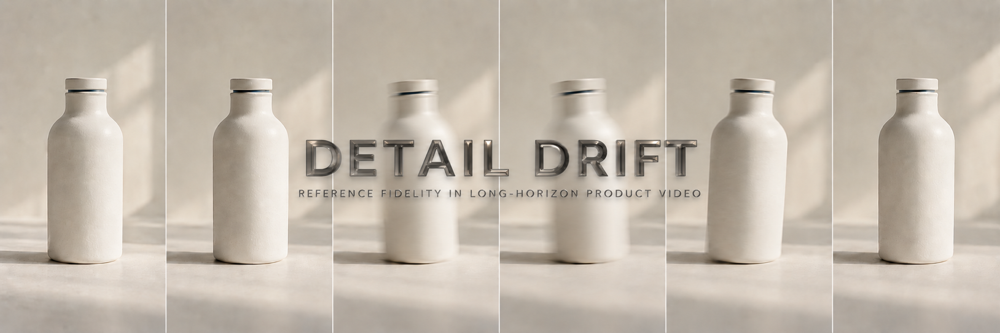
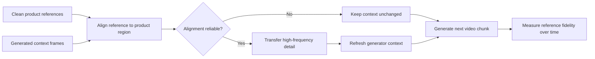

<p align="center">
  
</p>

<h1 align="center">Detail Drift</h1>

<p align="center">
  <strong>How long does the product stay the product?</strong><br />
  Measuring and repairing reference fidelity in long-horizon product video generation.
</p>

<p align="center">
  
  
  
  
</p>

---

Generated product videos can remain globally plausible while quietly losing the details that make a product identifiable: label text changes, logos soften, colours shift, and local textures disappear.

**Detail Drift** is a research project investigating that gap. The planned work introduces a reference-grounded evaluation protocol, studies how fine-detail errors propagate through long video contexts, and tests whether clean product references can repair the context without directly editing generated output frames.

> This repository is currently in the **research-planning stage**. The protocol, method, experiments, and implementation are proposed work—not completed results.

## The research question

When a product image is animated into a 30–120 second video:

1. Does fine-grained fidelity to the clean product reference decay over time?
2. Do common global consistency metrics miss that decay?
3. Can reference-grounded context repair slow it without freezing motion or introducing artifacts?

## What we plan to contribute

| Workstream | Planned contribution | Why it matters |
|---|---|---|
| **ProductDrift** | A region-level, reference-grounded evaluation protocol calibrated against human judgments | Measures the product details that determine commercial usability |
| **Drift analysis** | Cross-model measurements, propagation analysis, and a derived *usable horizon* | Shows when and how a generated product stops being acceptable |
| **RGCR** | A training-free method that restores aligned high-frequency reference detail inside the model context | Tests whether drift can be reduced without retraining or post-editing outputs |

## The idea in one view



RGCR is designed to modify only the generator's **context**. It does not paste reference pixels into the final output. Any improvement must therefore be re-rendered by the video model itself.

## ProductDrift at a glance

The proposed score tracks four complementary signals inside the product region:

- **Semantic fidelity** — masked DINO-style feature similarity.
- **Local detail** — geometrically verified feature matches.
- **Text fidelity** — normalized OCR agreement for printed labels.
- **Colour fidelity** — perceptual colour difference, reported with lighting controls.

The project will summarize these signals as a Product Fidelity Score over time, then derive:

- average fidelity across the full video;
- early-to-late fidelity drop;
- drift slope;
- **usable horizon**: the first sustained point at which human-calibrated acceptability is lost.

## Planned evaluation

The study is designed around long-horizon image-to-video generation for e-commerce products. Planned comparisons include:

- contemporary open generator families;
- no-repair and first-frame anchoring baselines;
- post-hoc compositing as a deliberately different baseline;
- motion, visual quality, and chunk-boundary checks to catch trivial or frozen solutions;
- human acceptability judgments and cost per acceptable second.

The public repository focuses on the project vision. Detailed experimental protocols and internal planning materials will be released only when they are ready for reproducible use.

## Project status

| Phase | Status |
|---|---|
| Problem definition and scope | Complete |
| Literature map and novelty check | Drafted; requires ongoing re-checking |
| Baseline reproduction | Not started |
| ProductDrift pilot | Not started |
| RGCR prototype | Not started |
| Full evaluation and human study | Not started |

## Repository map

```text
.
├── assets/                                  # Repository visuals
├── CONTRIBUTING.md                          # Collaboration guidance
├── LICENSE                                  # MIT License
└── README.md                                # Project introduction
```

Implementation, experiment configuration, and reproducibility assets will be added as the corresponding phases begin.

## Who this is for

This project sits at the intersection of:

- long-horizon and autoregressive video generation;
- reference-conditioned generation and visual identity preservation;
- computer-vision evaluation;
- trustworthy generative media for e-commerce.

We welcome research discussion, reproducibility feedback, product-image datasets with clear usage rights, and collaboration on human evaluation. Read [CONTRIBUTING.md](CONTRIBUTING.md) before opening an issue or proposing a change.

## License and citation

This repository is released under the [MIT License](LICENSE). Formal citation metadata will be added when the research output is ready to cite.

---

<p align="center">
  <sub>Detail fidelity is not a cosmetic metric. For product video, it is the identity of the object.</sub>
</p>
